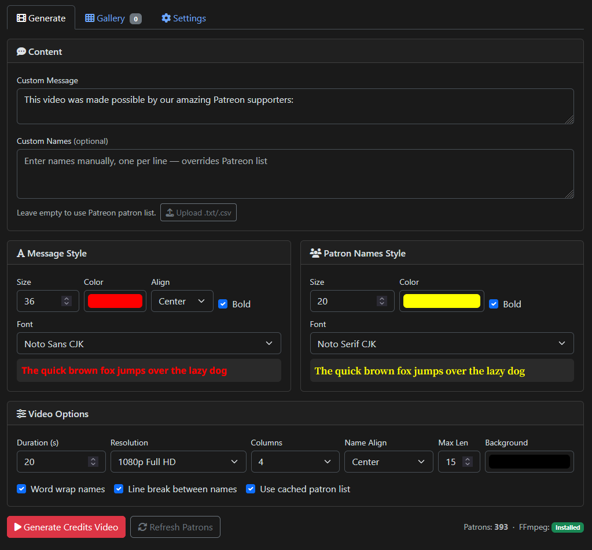
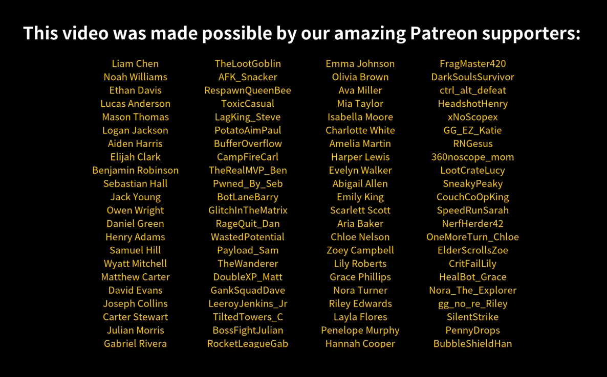

<p align="center">
  
</p>

<h1 align="center">Patreon Credits Generator</h1>

<p align="center">
  A standalone desktop app to generate scrolling end-credits videos for YouTube content creators, featuring their Patreon supporters.
</p>

<p align="center">
  <a href="../../releases"></a>
  <a href="https://hub.docker.com/r/mscrnt/patreon-credits"></a>
  <a href="https://hub.docker.com/r/mscrnt/patreon-credits"></a>
  <a href="../../pkgs/container/patreon-credits"></a>
  <a href="LICENSE"></a>
</p>

<p align="center">
  <br>
  <em>Configure styling, fonts, colors, and layout</em>
</p>

<p align="center">
  <br>
  <em>Generated scrolling credits video</em>
</p>

---

## Table of Contents

- [Download](#download)
- [Features](#features)
- [Quick Start (Desktop App)](#quick-start-desktop-app)
- [Docker](#docker)
- [Development Setup](#development-setup)
- [Getting Patreon Credentials](#getting-patreon-credentials)
- [Bundled Fonts](#bundled-fonts)
- [Building from Source](#building-from-source)
- [Project Structure](#project-structure)
- [Video Specifications](#video-specifications)
- [API Endpoints](#api-endpoints)
- [Adobe Premiere Pro Plugin](#adobe-premiere-pro-plugin)
- [Troubleshooting](#troubleshooting)
- [Tech Stack](#tech-stack)
- [Support](#support)

---

## Download

Grab the latest release for your platform from the [Releases page](../../releases):

| Platform | File | Notes |
|----------|------|-------|
| **Windows** | `PatreonCredits.exe` | Standalone executable |
| **Windows** | `PatreonCredits_Setup_*.exe` | Installer (adds Start Menu shortcut) |
| **macOS** | `PatreonCredits_*.dmg` | Drag to Applications |
| **Linux** | `PatreonCredits_*.AppImage` | `chmod +x` and run |

## Features

- Professional scrolling credits videos (MP4)
- Fetch active patrons from Patreon API
- Custom names input — paste or upload a `.txt`/`.csv` file (no Patreon required)
- Customizable duration (5-60 seconds)
- Custom header with alignment options (left, center, right, justified)
- 35 bundled font families (CJK + international character fallback)
- Customizable text colors, sizes, and bold
- Customizable background color
- 1-5 column layout with configurable alignment
- Name truncation or word wrap with hyphenation
- Optional separator lines between name rows
- 720p, 1080p, and 4K resolution
- Tabbed UI with Generate, Gallery, and Settings tabs
- Video gallery with thumbnails, preview, download, and delete
- Light and dark theme toggle (persists across sessions)
- In-app settings page for Patreon credentials
- Dummy data mode for testing
- Adobe Premiere Pro plugin for direct timeline integration
- Docker support for server/headless deployments

## Quick Start (Desktop App)

1. Download and run the app for your platform (see above)
2. On first launch, a setup wizard helps you configure Patreon credentials (or skip to use dummy data / manual names)
3. Configure your video options and click **Generate Credits Video**
4. Preview and download the result

Settings, cache, and output videos are stored in a data directory you choose during setup:
- **Windows default:** `Documents\PatreonCredits`
- **macOS default:** `Documents/PatreonCredits`
- **Linux default:** `~/PatreonCredits`

You can change the data directory at any time in **Settings**.

### Headless / API-Only Mode

To run just the server (for the Premiere plugin or API access) without opening a window:

```bash
PatreonCredits --headless
PatreonCredits --headless -p 9000   # custom port (default: 8787)
```

## Docker

The image is available from both registries:

```bash
# Docker Hub
docker pull mscrnt/patreon-credits

# GitHub Container Registry
docker pull ghcr.io/mscrnt/patreon-credits
```

### Quick Start

```bash
docker run -d \
  -p 8787:8787 \
  -e USE_DUMMY_DATA=true \
  -v patreon-output:/app/output \
  mscrnt/patreon-credits
```

Open http://localhost:8787.

### With Patreon Credentials

```bash
docker run -d \
  -p 8787:8787 \
  -e PATREON_TOKEN=your_token \
  -e PATREON_CAMPAIGN_ID=your_campaign_id \
  -v patreon-output:/app/output \
  mscrnt/patreon-credits
```

### Docker Compose

```bash
# Production (port 8787)
docker compose --profile prod up -d --build

# Development with hot reload (port 5000)
docker compose --profile dev up --build
```

### Makefile Shortcuts

```bash
make dev      # Dev container with hot reload (port 5000)
make prod     # Production container, detached (port 8787)
make down     # Stop all containers
make build    # Build images without starting
make logs     # Tail production container logs
make health   # Quick health check
```

### Environment Variables

| Variable | Default | Description |
|----------|---------|-------------|
| `PATREON_TOKEN` | | Patreon Creator Access Token |
| `PATREON_CAMPAIGN_ID` | | Patreon campaign ID |
| `USE_DUMMY_DATA` | `false` | Use dummy patron names for testing |
| `PORT` | `8787` | Server port |

### Volumes

| Volume | Purpose |
|--------|---------|
| `/app/output` | Generated video files |

## Development Setup

For contributors or running from source:

### Prerequisites

- Python 3.10+
- FFmpeg installed and in PATH

### Install

```bash
git clone https://github.com/mscrnt/patreon-credits.git
cd patreon-credits
python -m venv venv
source venv/bin/activate        # Linux/macOS
venv\Scripts\activate           # Windows
pip install -r requirements.txt
cp .env.example .env
```

Edit `.env` with your Patreon credentials (or set `USE_DUMMY_DATA=true`):
```
PATREON_TOKEN=your_creator_access_token
PATREON_CAMPAIGN_ID=your_campaign_id
USE_DUMMY_DATA=false
```

### Run

```bash
# Desktop mode (native window via pywebview)
python launcher.py

# Headless / API-only mode (no GUI window)
python launcher.py --headless
python launcher.py --headless -p 9000   # custom port

# Dev server (browser at http://localhost:5000, debug mode)
python app.py
```

## Getting Patreon Credentials

You need two values (configurable in the app's **Settings** page or `.env` file):

### 1. Creator Access Token (`PATREON_TOKEN`)

1. Go to [Patreon Platform](https://www.patreon.com/portal/registration/register-clients)
2. Create a new client/app (or use an existing one)
3. Copy your **Creator Access Token**

### 2. Campaign ID (`PATREON_CAMPAIGN_ID`)

Run this with your token from step 1:

```bash
curl -s -H "Authorization: Bearer YOUR_TOKEN_HERE" \
  "https://www.patreon.com/api/oauth2/v2/campaigns"
```

The campaign ID is in the `data[0].id` field.

## Bundled Fonts

35 font families are included in the `fonts/` directory, so no system font dependencies are needed:

**CJK + Latin:** Noto Sans CJK, Noto Serif CJK, LXGW WenKai, Zen Maru Gothic, M PLUS Rounded 1c, Shippori Mincho

**Sans-serif:** Inter, Roboto, Open Sans, Poppins, Montserrat, Raleway, Quicksand, Source Sans 3, Lato, Nunito, Rubik, DM Sans, Josefin Sans, Ubuntu, Oswald, Bebas Neue

**Serif:** Cinzel, Playfair Display, Merriweather, Crimson Text, Lora, Libre Baskerville, Arvo, Neuton

**Display:** Alfa Slab One, Bangers

**Handwriting/Script:** Permanent Marker, Pacifico, Playwrite DE Grund

Noto Sans CJK is the default and supports Latin, Chinese, Japanese, and Korean characters.

## Building from Source

### Platform build scripts

```bash
# Windows (run from cmd)
scripts\build_windows.bat

# macOS
./scripts/build_macos.sh

# Linux
./scripts/build_linux.sh
```

Each script runs PyInstaller and creates the platform-specific package (Inno Setup installer, DMG, or AppImage). Builds must run on the target platform — PyInstaller cannot cross-compile.

### CI/CD

Pushing a `v*` tag triggers GitHub Actions to:
- Build desktop apps for all three platforms and create a [GitHub Release](../../releases) with artifacts
- Build and push the Docker image to [Docker Hub](https://hub.docker.com/r/mscrnt/patreon-credits) and [GHCR](../../pkgs/container/patreon-credits)

## Project Structure

```
patreon-credits/
├── app.py                  # Flask server + routes
├── launcher.py             # Desktop app entry point (pywebview)
├── path_utils.py           # Path resolution (dev vs frozen)
├── patreon.py              # Patreon API client
├── ffmpeg_renderer.py      # Pillow + FFmpeg video rendering
├── patreon_credits.spec    # PyInstaller build spec
├── Dockerfile              # Multi-stage Docker build (dev + prod)
├── docker-compose.yml      # Dev and prod profiles
├── Makefile                # Common dev/docker commands
├── fonts/                  # Bundled font files (35 families)
├── templates/
│   ├── index.html          # Main UI (tabbed: Generate, Gallery, Settings)
│   ├── setup.html          # First-run setup wizard
│   └── swagger.html        # API docs
├── static/
│   ├── css/                # Theme and app stylesheets
│   ├── js/                 # App, gallery, settings, theme scripts
│   └── img/                # Placeholder images
├── installer/
│   └── patreon_credits.iss # Inno Setup script (Windows)
├── scripts/
│   ├── build_windows.bat   # Windows build script
│   ├── build_macos.sh      # macOS build script
│   └── build_linux.sh      # Linux build script
├── plugins/
│   └── adobe-premiere/     # Premiere Pro CEP panel plugin
├── .github/workflows/
│   ├── build.yml           # CI/CD (cross-platform desktop builds)
│   └── docker.yml          # Docker build + push (DockerHub + GHCR)
├── .env.example            # Configuration template
├── requirements.txt        # Python dependencies
└── requirements.docker.txt # Docker dependencies (no pywebview/pyinstaller)
```

## Video Specifications

- **Resolutions:** 720p HD, 1080p Full HD, 4K UHD
- **Format:** MP4 (H.264)
- **Background:** Customizable color (default: black)
- **Header:** Static at top, customizable font/color/size/alignment
- **Names:** Scrolling bottom-to-top, gold (#FFD700) by default
- **Layout:** 1-5 columns with left/center/right alignment
- **Name options:** Truncation with max length, word wrap with hyphenation, separator lines between rows
- **CJK support:** Proper character width handling via Pillow's `font.getlength()`

## API Endpoints

| Method | Path | Description |
|--------|------|-------------|
| `GET` | `/` | Main web interface |
| `POST` | `/generate` | Generate credits video (accepts `custom_names` for manual input) |
| `GET` | `/download/<filename>` | Download generated video |
| `GET` | `/api/videos` | List all generated videos with metadata |
| `GET` | `/api/thumbnail/<filename>` | Get video thumbnail (auto-generated, cached) |
| `DELETE` | `/api/videos/<filename>` | Delete a generated video and its thumbnail |
| `GET` | `/patron-count` | Get current patron count |
| `POST` | `/refresh-patrons` | Force-refresh patron list from Patreon API |
| `GET` | `/check-ffmpeg` | Check FFmpeg installation |
| `GET` | `/health` | Health check (Docker/orchestration) |
| `GET` | `/settings` | Settings (JSON) |
| `POST` | `/settings` | Save settings to `.env` |
| `GET` | `/api/docs` | Swagger UI documentation |
| `GET` | `/api/spec` | OpenAPI 3.0 JSON specification |

## Adobe Premiere Pro Plugin

An Adobe Premiere Pro panel plugin is included in `plugins/adobe-premiere/`. It lets you generate and insert credits videos directly from within Premiere Pro.

See the [plugin README](plugins/adobe-premiere/README.md) for installation and usage instructions.

## Troubleshooting

### FFmpeg not found
Click the **Install** button next to the FFmpeg status indicator, or go to **Settings** and click **Download & Install FFmpeg**. The app downloads a portable FFmpeg binary to its data directory — no admin privileges or system PATH changes needed.

### No patrons showing
- Check credentials in **Settings** or `.env`
- Try the **Refresh Patron List** button
- Or paste names directly in the **Custom Names** textarea

### Video generation fails
- Check FFmpeg status indicator
- Ensure sufficient disk space
- Check the console/terminal for error messages

## Tech Stack

- **Flask** — web server
- **pywebview** — native desktop window (WebView2 on Windows, WebKit on macOS/Linux)
- **PyInstaller** — standalone packaging
- **Docker** — containerized server deployments
- **Pillow** — text rendering with font fallback (fontTools cmap)
- **FFmpeg** — video compositing (H.264 MP4)
- **Patreon API v2** — patron data
- **Bootstrap 5.3** — responsive UI with dark/light theme support
- **Font Awesome 6** — icons
- Vanilla JavaScript frontend with localStorage persistence

## Support

If you find this tool useful, consider supporting development:

[](https://buymeacoffee.com/mscrnt)

## License

MIT License - feel free to use this tool for your content creation needs!
